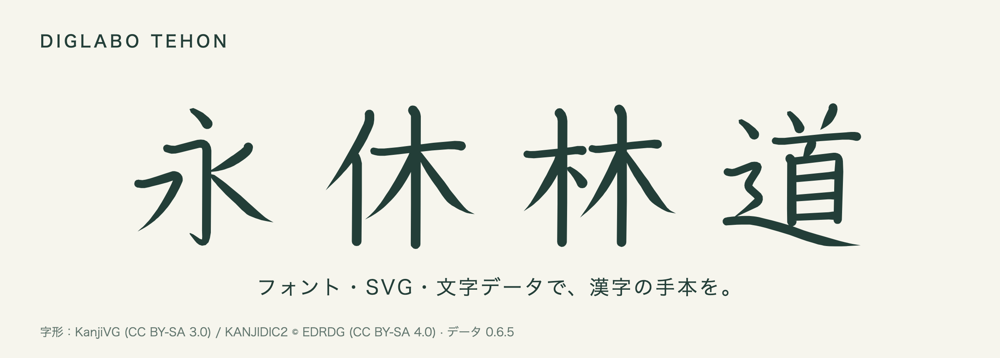
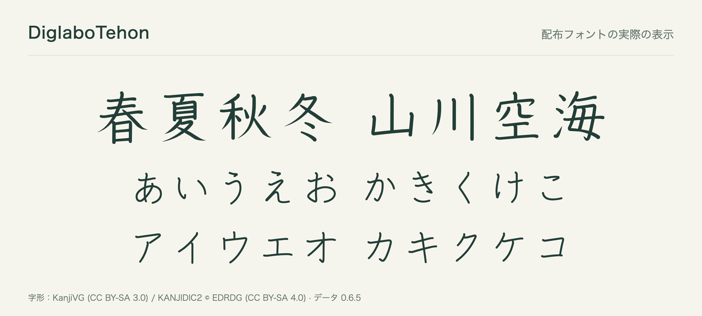
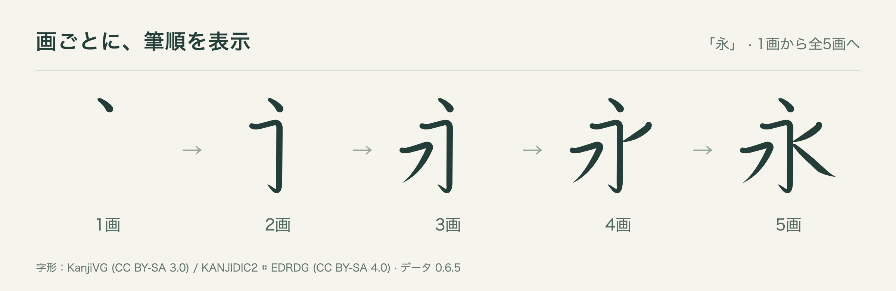
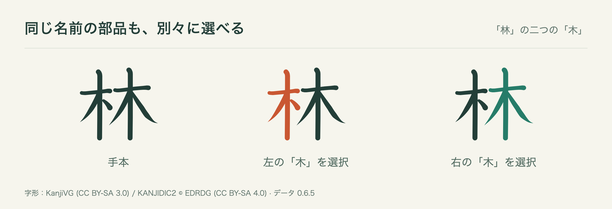

# diglabo-kanji-data

**漢字とかなの手本を、フォント・SVG・文字データとして。**

常用漢字 **2,136字** とかな **177字** を収録。[diglabo](https://diglabo.com)の漢字教材から生まれた、手本フォントと教材開発用ライブラリです。



**[フォントをダウンロード](https://github.com/make1s/diglabo-kanji-data/releases/download/renderer-v0.1.0-rc.1/diglabo-kanji-fonts-0.6.5.zip)** · **[ブラウザで試す](https://make1s.github.io/diglabo-kanji-data/)** · [配布物と変更履歴](https://github.com/make1s/diglabo-kanji-data/releases/tag/renderer-v0.1.0-rc.1)

## 何を使いますか？

| やりたいこと | 使うもの | はじめる |
|---|---|---|
| プリント・スライド・Webに手本の文字を載せる | **DiglaboTehon**（OTF / WOFF2） | [フォントだけ使いたい](#フォントだけ使いたい) |
| 筆順を表示する・部品に色をつける | **@diglabo/kanji** + 文字データ | [アプリに組み込みたい](#アプリに組み込みたい) |
| 読み・学年・部首・部品構造を使う | **@diglabo/kanji-data** / JSON | [文字データを使いたい](#文字データを使いたい) |

## フォントだけ使いたい

### まずはZIPをダウンロード

**[DiglaboTehon 一式をダウンロード（ZIP / データ版0.6.5）](https://github.com/make1s/diglabo-kanji-data/releases/download/renderer-v0.1.0-rc.1/diglabo-kanji-fonts-0.6.5.zip)**

PC用のOTF、Web用のWOFF2、使い方、ライセンスと出典情報をまとめています。ZIPを解凍して使えます。



| 使う場所 | ファイル | 使い方 |
|---|---|---|
| **PCの文書・スライド・DTP** | `fonts/tehon.otf` | OSにインストールし、アプリのフォント欄で **DiglaboTehon** を選ぶ |
| **Webサイト・Web教材** | `fonts/tehon.woff2` | サイトに同梱し、CSSの`@font-face`で読み込む |

PCではZIP内の`tehon.otf`を開いてインストールします。Web用CSSと、単体ファイルのダウンロードは[フォントの使い方](./docs/fonts.md)にまとめています。

収録範囲は常用漢字・ひらがな・カタカナ・長音符です。英数字・句読点などは、併用するフォントで表示してください。

**利用条件はCC BY-SA 4.0です。** 画面・印刷物の出典表示と、再配布時のライセンス同梱などが必要です。[利用条件と出典表示](#利用条件と出典表示)を確認してください。

## アプリに組み込みたい

手本SVG、画ごとの筆順表示、部品の色分けを生成できます。ブラウザとNode.js 22以上で使えるESMです。



筆順は0画から全画まで、画ごとに切り替えられます。



「林」の二つの「木」も、部品識別子で別々に選べます。

### 一文字を表示する

```sh
npm install @diglabo/kanji@next @diglabo/kanji-data@next
```

```ts
import kyu from "@diglabo/kanji-data/chars/04f11";
import { renderCharacter } from "@diglabo/kanji";

const { svg, attribution } = renderCharacter(kyu, { size: 160 });
// svgを表示し、attribution.textを画面・印刷物の出典欄に載せます。
```

一文字のimportで、Webへ全字形を送りません。SVGはフォントを読み込まずに表示できます。

| 次に試すこと | 案内 |
|---|---|
| 筆順・部品選択のオプションを使う | [描画API](./packages/kanji/README.md) |
| ブラウザで動かす | [公開デモ](https://make1s.github.io/diglabo-kanji-data/) · [JavaScriptの例](./examples/browser/main.js) |
| Reactに組み込む | [Reactデモ](https://make1s.github.io/diglabo-kanji-data/react.html) · [ソース](./examples/react/main.tsx) |
| Node.jsで教材を作る | [HTML教材を書き出す例](./examples/node/lesson.mjs) |

現在は0.xの試用版です。描画 **0.1.0** / 文字データnpm **0.6.5-pkg.1** / データ版 **0.6.5** / schemaVersion **1**。版を固定する場合は`next`をそれぞれのバージョンに置き換えます。画の途中までのアニメーションや手書き採点は含みません。

## 文字データを使いたい

筆順・画の輪郭・部品階層に加え、**読み・教育用読み・読みの段階・配当学年・部首**を使えます。

| 取り込み方 | 入手先 | 内容 |
|---|---|---|
| JavaScript / TypeScript | [@diglabo/kanji-data](https://www.npmjs.com/package/@diglabo/kanji-data) | 型付きの文字別モジュール・索引・manifest |
| JSONを直接読む | [JSON一式をダウンロード（ZIP）](https://github.com/make1s/diglabo-kanji-data/releases/download/renderer-v0.1.0-rc.1/diglabo-kanji-data-0.6.5.zip) | 1字1ファイルのJSON・索引・ライセンス |

```ts
import kyu from "@diglabo/kanji-data/chars/04f11";

console.log(kyu.record.char);        // 休
console.log(kyu.record.grade);       // 1
console.log(kyu.record.eduReadings); // 小学校段階の音読み・訓読み
```

npmには全2,313字が含まれます。必要な文字JSONだけをサイトに同梱する使い方もできます。[文字データnpmの使い方](./packages/data/README.md) · [JSONの形式と各項目の説明](./docs/data-format.md)

## 利用条件と出典表示

| 対象 | ライセンス |
|---|---|
| 手本フォント・文字データ・字形由来のSVG・このページの見本画像 | **CC BY-SA 4.0** |
| 新規の描画runtimeと公開型 | **MIT** |

画面や印刷物には、次の出典を表示してください。

```text
KanjiVG (CC BY-SA 3.0) / KANJIDIC2 © EDRDG (CC BY-SA 4.0)
```

フォント・データを再配布する場合は`LICENSE`と`ATTRIBUTION.md`を同梱し、改変を配布する場合は変更を明示してCC BY-SA 4.0を維持してください。描画runtimeのMITが字形の利用条件を置き換えるものではありません。[用途別の利用条件](./docs/library-licenses.md) · [帰属情報](./ATTRIBUTION.md) · [LICENSE](./LICENSE)

字形と筆順は[KanjiVG](https://kanjivg.tagaini.net/)、辞書情報は[KANJIDIC2](https://www.edrdg.org/wiki/index.php/KANJIDIC_Project)、教育用読みと段階は[文部科学省の音訓割り振り表](https://www.mext.go.jp/a_menu/shotou/new-cs/1385768.htm)をもとにしています。

## 開発・更新・問い合わせ

- [開発・データ生成・README画像の再生成](./docs/development.md)
- [筆圧つきアウトラインの設計](./docs/stroke-outlines.md)
- [互換表・検証・公開・データ更新の手順](./docs/public-library-release.md)
- [変更履歴](./CHANGELOG.md) · [不具合・利用例の報告（GitHub Issues）](https://github.com/make1s/diglabo-kanji-data/issues)

自社の教材で使いながら改善しています。試用版への問い合わせはIssuesへお願いします。対応期限は設けていません。
